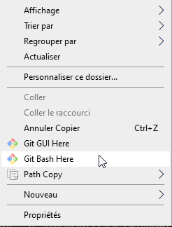

# Chaîne de traitement pour traiter et téléverser des photos 360° vers Mapillary

Ce projet rassemble les ressources qui permettent de traiter les images 360° dérivées de l'acquisition *mobile mapping* pour le RMTR surface. Ces images sont en effet un produit dérivé des acquisitions LIDAR faite avec du matériel [Ladybug](https://www.flir.fr/products/ladybug5plus/).

Mais les images récupérées ne sont pas bien crées et ne sont pas, dans leur état natif, des images 360°.


## Principe

Le script :
1. lit le fichier IML d'une campagne d'acquisition
2. en dérive un fichier CSV avec les attributs utiles : image, time, x, y, z, h
3. modifie les métadonnées EXIF des images pour injecter les données de localisation afn de les rendre 360°
4. appelle les *mapillary tools* pour prétraiter les images (supression des images trop proches, par exemple)
5. téléverse vers l'API de Mapillary


## Prérequis

- terminal MINTTY (installé via git pour Windows)
- `alias python='winpty -Xallow-non-tty python.exe'` dans le fichier `bash_profile` **<<< important**
- Python 3.6.8
- les modules python dans le répertoire `modules_python` ou listés dans le fichier `requirements.txt`


**IMPORTANT** : pour pouvoir faire la saisie du mot de passe à l'étape de demande d'identification pour obtenir le token, sous git bash pour Windows il faut impérativement rajouter l'alias mentionné dans les prérequis. Ceci permet d'éviter l'erreur `stdout is not a tty`, qui ici ne sort pas car la fonction de demande de mot de passe cachée raccroche sans rien dire.


## Installation des librairies Python (à ne faire qu'une fois)

Activer une session virtuelle Python.

**Pour toute opération (installation ou utilisation) on va se mettre dans une session virtuelle Python**. Voir [la procédure](python_venv.md) pour mettre en place une session virtuelle Python.


On installe les librairies, via un script car il y a un ordre à cause des dépendances

	install_librairies.sh

Vérifier qu'il n'y a pas d'erreurs.

**Note pour Linux**

Et si hors réseau bloqué : utiliser le fichier `requirements.txt` puis installer manuellement les mapillary-tools :

```
venv venv --system-site-packages
python3 -m pip install -r requirements.txt
python3 -m pip install modules_python/mapillary_tools-0.7.4-py3-none-any.whl
```


## Utilisation

Pour info : shift + insert pour coller des commandes.

**Pour toute opération (installation ou utilisation) on va se mettre dans une session virtuelle Python**. Voir [la procédure](python_venv.md) pour mettre en place une session virtuelle Python (à faire 1 seule fois à l'installation).


Pour utiliser le script, ouvrir une fenêtre Windows et aller dans `C:\\Users\acces.sig\Documents\mapillary_rm\`

Ouvrir un shell Git bash : clic-droit > Git bash here




Activer une session virtuelle Python : `source ./venv/Scripts/activate`


Afficher l'aide

	process_sequence.py -h
	
	usage: process_sequence.py [-h] [--skip-preprocess] [--skip-exif]
							   [--skip-upload]
							   DATE PATH MAPILLARY_USER

	Processing Geofit files for geolocating pictures and upload to Mapillary

	positional arguments:
	  DATE               pictures shooting date in YYYY-MM-DD format
	  PATH               path to access one sequence files (IML + JPG)
	  MAPILLARY_USER     Mapillary user name

	optional arguments:
	  -h, --help         show this help message and exit
	  --skip-preprocess  don't run preprocessing of pictures
	  --skip-exif        don't write updated EXIF metadata in pictures
	  --skip-upload      don't run upload of pictures


## Pour visualiser les photos téléversées :
https://www.mapillary.com/app/
courriel : sig@rennesmetropole.fr
mdp : streetviewsuks
user : sig_rm	  
	  

Le principe est d'appeler le script python depuis le répertoire du script (soit le répertoire courant), puis le répertoire qui contient le fichier IML, puis spécifier l'utilisateur Mapillary pour téléverser les images.


Conseil : utiliser la touche tabulation pour naviguer dans le système de fichiers. Très utile à cause des espaces dans les noms des répertoires, car ceux-ci doivent être "échappés" avec un anti-slash.
/ sig rm

Exemple de chemin python : `/h/3_Photos/2017-10-04\ -\ RENNES\ -\ Corps_Nuds0410/`
	


### 1- Juste analyser et traiter le fichier IML

	
	python process_sequence.py --skip-exif --skip-upload 2018-02-16 /chemin_absolu_vers\ le\ repertoire/ sig_rm
	
				(exemple) /p  /p/3_photos/Noyal_01_28/ sig_rm

### 2- Juste patcher les métadonnées EXIF des photos : pas de preprocess ni d'upload

	python process_sequence.py --skip-preprocess --skip-upload 2018-02-16 /chemin_absolu_vers\ le\ repertoire/ sig_rm sig_rm
	
				(exemple)  python process_sequence.py --skip-preprocess --skip-upload 2019-01-28  /p/3_photos/Noyal_01_28/ sig_rm

### 3- Juste l'upload

	python process_sequence.py --skip-preprocess --skip-exif 2018-02-16 /chemin_absolu_vers\ le\ repertoire/ sig_rm sig_rm

				(exemple)  python process_sequence.py --skip-preprocess --skip-exif 2019-01-28  /p/3_photos/Noyal_01_28/ sig_rm
	
	
### La totale

	python process_sequence.py 2018-02-16 /chemin_absolu_vers\ le\ repertoire/ sig_rm sig_rm

				(exemple)    2019-01-28  /p/3_photos/Noyal_01_28/ sig_rm

A chaque lancement, le script va vérifier les dates dans le fichier IML et demander de valider ou corriger date et heure de début des prises de vues.
Exemple :


	traitement\process_sequence.py --skip-upload 2018-02-16 ./ sig_rm
	Checking picture validity 16225/16226 (99%)
	Found 1 IML files
	Found 16226 JPG files
	Reading IML file line 3/438103 (0%)
	Start date read from IML : 2024-07-16T11:03:11.356000
	Do you want to use your date instead (2018-02-16) ? (y/n) y
	Set the capture start time (in HH:MM format) : 09:00   


Pour vérifier que les coordonnées sont bonnes on peut ouvrir une image dans XnView.

menu Edition > métadonnées > Ouvrir la position GPS dans geohack


## Notes

Pour la partie GDAL on utilise le .whl de ce site 
https://www.lfd.uci.edu/~gohlke/pythonlibs/#gdal


python process_sequence.py 2020-07-16 /h/3_Photos/2020-07-17/ sig_rm


python process_sequence.py --skip-exif --skip-upload 2020-07-16 /h/3_Photos/2020-07-16/ sig_rm
