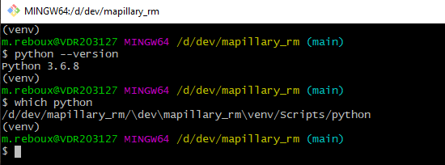

# Environnement virtual Python... sous Windows


## Prérequis

- terminal MINTTY (installé via git pour Windows)


## Mettre en route un environnement python virtuel

Se déplacer dans le répertoire du projet puis taper :

`python.exe -m venv venv`

cela va créer un répertoire `venv` qui contient l'environnement Python qui sera utilisé. Il y a un répertoire `Include`, un répertoire `Lib` et un répertoire `Scripts`.

**Note pour Linux**

Sous Linux il y a un problème avec GDAL qui refuse de compiler. Il suffit de créer le venv de cette manière : 

`python3 -m venv venv --system-site-packages`

Puis : 

```
python3 -m pip install GDAL
Requirement already satisfied: GDAL in /usr/lib/python3/dist-packages (3.0.4)
```


## Activer une session virtuelle Python

`source ./venv/Scripts/activate`

Pour savoir si une session venv est en route ou pas en demandant où se situe l'appli Python utilisée : `which python`

Le résultat donnera normalement le chemin vers `[mon_appli]\venv/Scripts/python`





## Installer un module python uniquement pour le projet / l'application

/!\ Pour l'installation des modules Python nécessaires il y a un script dédié à cela. A cause de l'ordre des dépendances.


Exemple :

```
cd modules_python
python -m pip install idna-2.10-py2.py3-none-any.whl
```

On trouvera ensuite un répertoire `idna-2.10.dist-info` dans le répertoire `venv\Lib\site-packages`.


